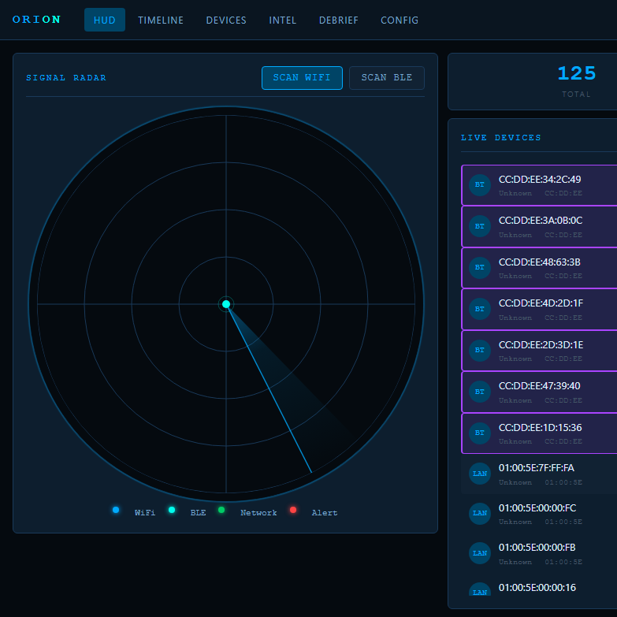
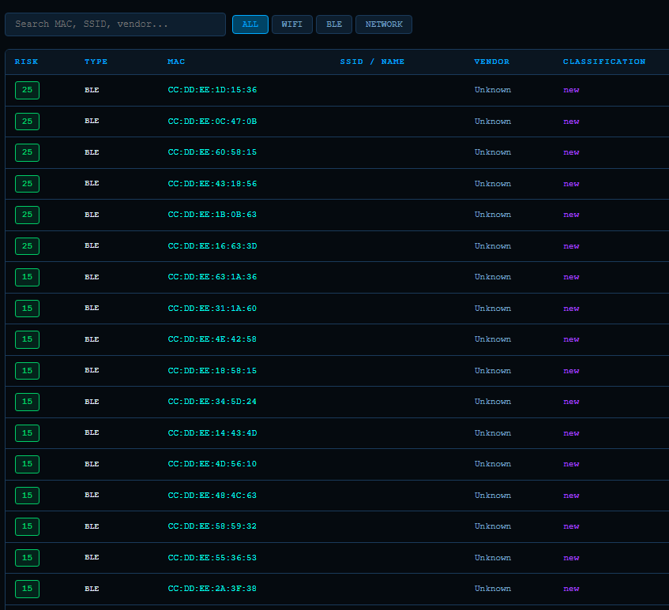
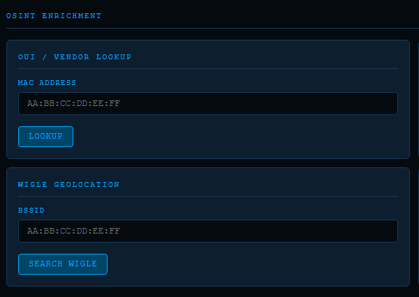
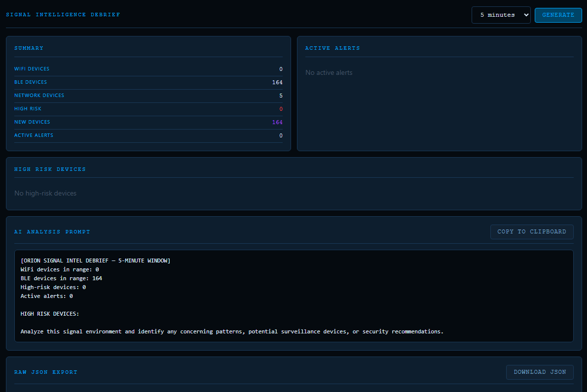
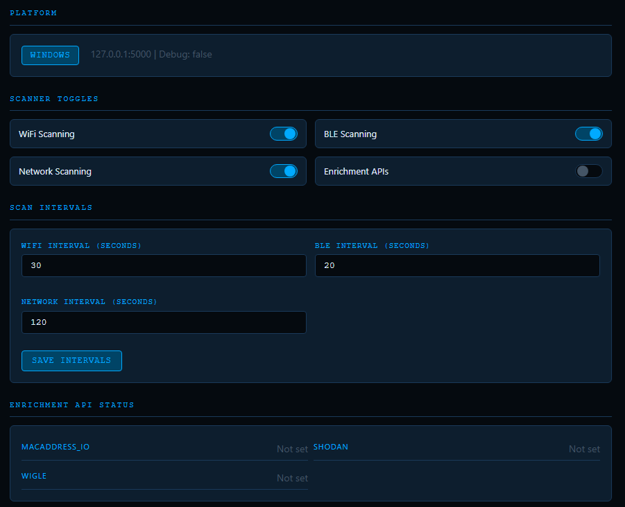

# ORION — Open Source Passive Signal Intelligence

> WiFi + BLE + Network passive scanning with tactical HUD radar.
> No camera. No mic. No cloud. Just signal.

Built as a free, open source alternative to SOPHIA CIVOPS.
Runs on Android (Termux), Raspberry Pi, and Linux.

---

## Features

- Live WiFi scanning — SSID, BSSID, RSSI, security type, distance estimate
- Passive BLE scanning — device name, manufacturer ID, AirTag detection
- LAN network scanner — ARP + nmap device discovery
- OUI vendor lookup — IEEE database bundled locally
- Risk scoring — 15+ flag types including camera vendor OUIs, open networks, hidden SSIDs
- Device classification — Static / Transient / Mobile / New / Baseline
- Intel Timeline — persistent event log in SQLite
- AirTag / FindMy beacon detection
- ESP32/ESP8266 (hidden camera chip) detection
- SSID identity extraction — detects personal hotspot names, employer SSIDs, ISP patterns
- Export Debrief — structured 5-minute intelligence window, AI-prompt ready
- WiGLE geolocation (optional, requires free account)
- NVD CVE lookup for detected vendors (optional, no key required)
- Tactical HUD radar — canvas-based, dark UI, runs in Chrome on the phone

---

## Screenshots

| HUD Radar | Device Inventory |
|:---------:|:----------------:|
|  |  |

| OSINT Enrichment | Signal Debrief |
|:----------------:|:--------------:|
|  |  |

| Settings |
|:--------:|
|  |

---

## Platform Support

| Feature            | Android (Termux) | Raspberry Pi | Linux | Windows (dev) |
|--------------------|:----------------:|:------------:|:-----:|:-------------:|
| WiFi scanning      | ✓                | ✓            | ✓     | mock          |
| BLE scanning       | partial*         | ✓            | ✓     | mock          |
| Network (ARP/nmap) | ✓                | ✓            | ✓     | mock          |
| HUD browser UI     | ✓                | ✓            | ✓     | ✓             |
| Offline operation  | ✓                | ✓            | ✓     | ✓             |

*BLE on Termux requires Termux:API from F-Droid + Location permission

---

## Android (Termux) — Quick Install

### Requirements
- Android 8+
- [Termux](https://f-droid.org/packages/com.termux/) from F-Droid
- [Termux:API](https://f-droid.org/packages/com.termux.api/) from F-Droid (separate app)
- Location permission granted to Termux:API (Allow all the time)
- Nearby Devices permission granted to Termux:API

> ⚠ Do NOT install Termux from the Google Play Store — it is outdated and broken.

### Install Steps
```bash
# 1. Update Termux
pkg update -y && pkg upgrade -y

# 2. Install dependencies
pkg install -y python git nmap termux-api python-psutil

# 3. Set up storage
termux-setup-storage

# 4. Clone ORION
cd ~
git clone https://github.com/Chemtron/orion.git
cd orion

# 5. Install Python packages
pip install -r requirements-termux.txt

# 6. Run
python orion.py
```

Then open Chrome on your phone and go to `http://127.0.0.1:5000`

### Troubleshooting WiFi Scan Returns Nothing
```bash
# Test 1 — does termux-wifi-scaninfo work?
termux-wifi-scaninfo

# Test 2 — start the API service
termux-api-start
termux-wifi-scaninfo

# Test 3 — check location permission
termux-location
```

If `termux-wifi-scaninfo` hangs or returns empty:
1. Open Android Settings → Apps → Termux:API → Permissions → Location → **Allow all the time**
2. Open Android Settings → Apps → Termux:API → Permissions → Nearby devices → **Allow**
3. Make sure WiFi is turned on
4. Run `termux-api-start` then try again

---

## Raspberry Pi — Quick Install
```bash
cd ~
git clone https://github.com/Chemtron/orion.git
cd orion
bash install.sh
python3 orion.py
```

Access from any device on your LAN: `http://[PI_IP_ADDRESS]:5000`

To find your Pi's IP: `hostname -I`

---

## Linux — Quick Install
```bash
git clone https://github.com/Chemtron/orion.git
cd orion
bash install.sh
python3 orion.py
```

---

## Windows (Development Only)
```bash
git clone https://github.com/Chemtron/orion.git
cd orion
pip install -r requirements.txt
python orion.py
```

Windows uses mock scan data. Real scanning requires Termux or Linux.

---

## Configuration

Edit `.env` in the project root:

| Variable | Default | Description |
|---|---|---|
| ORION_HOST | 127.0.0.1 | Bind address (use 0.0.0.0 for LAN access) |
| ORION_PORT | 5000 | Port |
| ENABLE_WIFI | true | WiFi scanning on/off |
| ENABLE_BLE | true | BLE scanning on/off |
| ENABLE_NETWORK | true | LAN scanning on/off |
| ENABLE_ENRICHMENT | false | Online enrichment on/off |
| WIGLE_API_NAME | blank | WiGLE account name |
| WIGLE_API_TOKEN | blank | WiGLE API token |
| SHODAN_API_KEY | blank | Shodan API key |
| MACADDRESS_IO_KEY | blank | macaddress.io key |

---

## Legal

For defensive security, privacy awareness, and authorized use only.
Do not use to scan networks or devices you do not own or have permission to scan.
MIT License — see LICENSE file.
